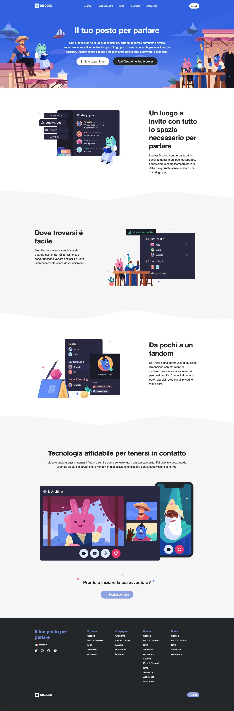
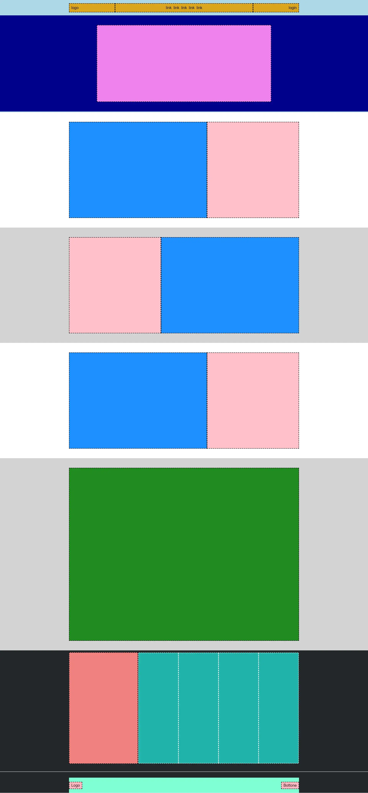

Settimo Esercizio Classe #137 - Boolean
===
Studente: Fabio Ferrero

---
# English

## Target of the project:
Replicate the layout of a complex web page using known HTML\CSS code from a screenshot

---
# Italiano

## Obiettivo del progetto:
Replicare il layout di una pagina web complessa usando il codice conosciuto di HTML\CSS da uno screenshot

---

---

---
<strong>Gli screenshot forniti dal coach sono i seguenti:</strong>

